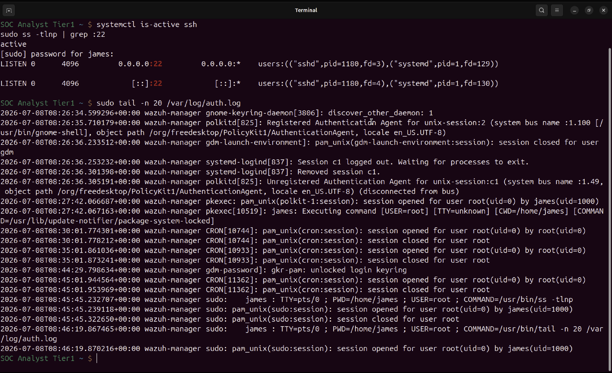
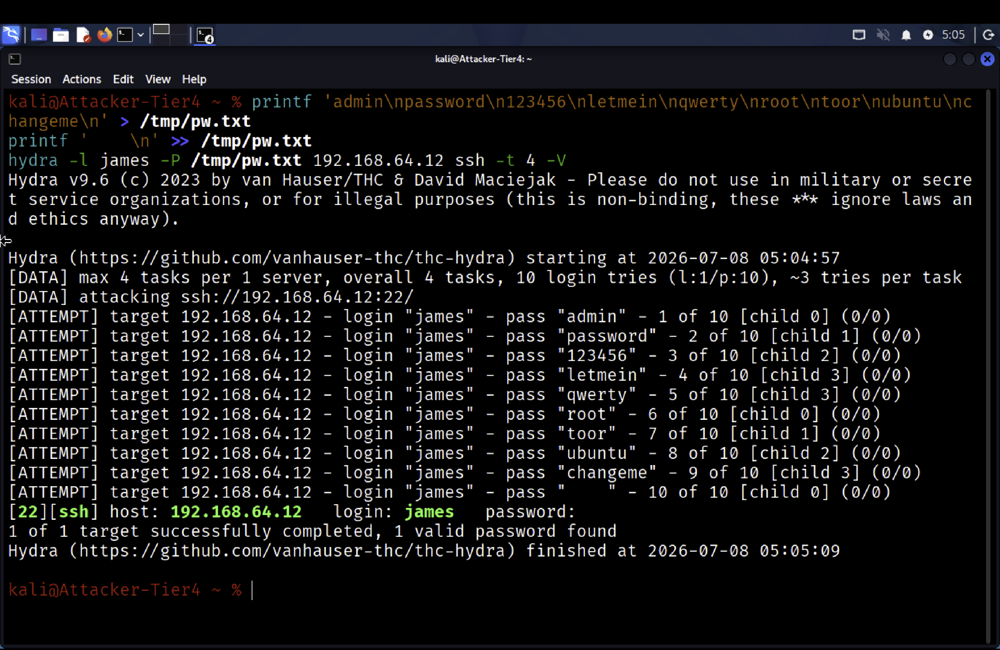
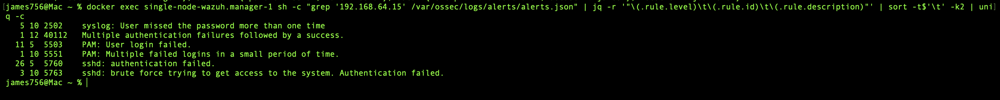
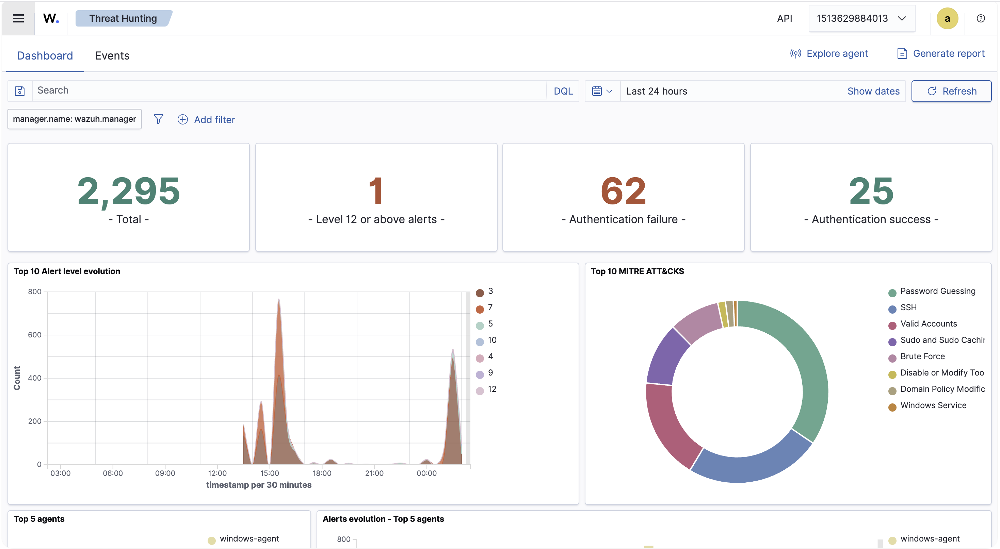
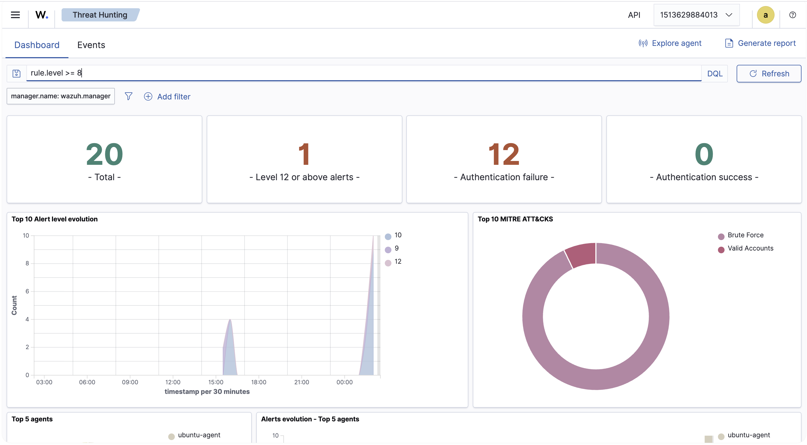
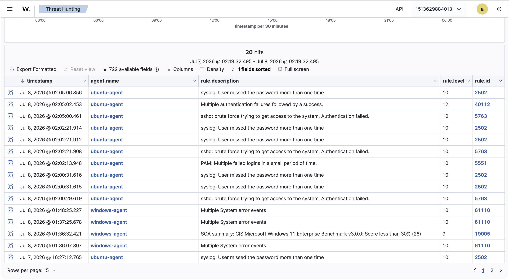
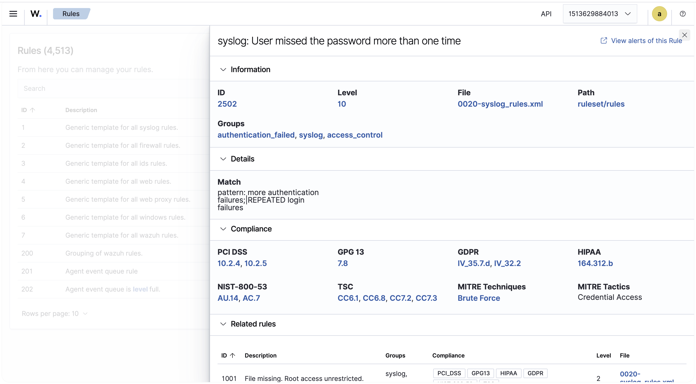

# SSH Brute Force Detection with Wazuh, MITRE T1110

One source IP, a burst of failed SSH logins, then one success. The whole difference between a failed brute force and a real compromise is a single log line, and this lab catches it: Wazuh escalates from a level 5 decoder event to a level 12 alert the moment the attacker guesses right.

## At a Glance

| Field | Detail |
| --- | --- |
| Work Type | Detection engineering, host-based |
| Attack | SSH brute force to confirmed compromise |
| Platform | Wazuh 4.14.6, single-node Docker stack |
| Victim | ubuntu-agent, Ubuntu 24.04.4 LTS |
| Attacker | Kali Linux, 192.168.64.15 |
| MITRE | T1110, T1110.001, T1021.004, T1078 |
| Critical Alert | Rule 40112, level 12, failures followed by success |
| Detection Date | 07 July 2026 |

## What This Is

An end-to-end SSH brute force detection built in a self-contained home lab. A Kali attacker runs Hydra against SSH on an Ubuntu host monitored by Wazuh. Wazuh correlates the burst of failed authentications into escalating alerts and raises a level 12 alert when the attacker guesses the correct password.

The attack is real, the detection chain is traced from individual failed logins through to the compromise, and every finding is backed by a screenshot. The attack was contained to a controlled lab.

## Incident Summary

On 08 July 2026, the ubuntu-agent host recorded a rapid sequence of failed SSH logins for the user james, all from a single source IP. Wazuh decoded each failure through its sshd and PAM decoders, then fired frequency-based correlation rules that classified the activity as brute force. A final authentication succeeded, and Wazuh raised rule 40112 at level 12, "Multiple authentication failures followed by a success," indicating the account was compromised.

The level 12 alert is the finding that matters. A brute force that only fails is noise the platform should absorb. A brute force that fails and then succeeds is an incident, and a detection pipeline is only worth having if it can tell those two apart. This one can.

## Affected System

| Attribute | Value |
| --- | --- |
| Victim host | ubuntu-agent (Wazuh agent ID 001) |
| Victim OS | Ubuntu 24.04.4 LTS |
| Filtered identity | host wazuh-manager |
| Targeted account | james |
| Attacker host | Kali Linux, hostname Attacker-Tier4 |
| Attacker source IP | 192.168.64.15 |
| Monitoring platform | Wazuh 4.14.6, single node Docker stack |
| Detection date | 07 July 2026 |

## Investigation Methodology

### 1. Baseline

Before any attack, the victim's authentication state was captured to establish a known-good reference. SSH was confirmed active and listening on port 22, and the auth log showed only routine session activity with no failed password events.



**SOC Observations**

The auth log contained only expected entries such as cron sessions, gnome keyring, and local sudo activity. No failed SSH authentications were present, so any subsequent failure spike would be clearly attributable to the attack rather than background noise. The baseline is what makes the detection measurable rather than assumed.

### 2. Attack

An SSH brute force was launched from Kali using Hydra against the victim on port 22, targeting the james account with a small password list. The list ended with the account's real password, producing a realistic many-failures-then-one-success pattern.



**SOC Observations**

Hydra reported one valid password found, confirming the account was reachable and the credential was guessable. The plaintext password file was securely deleted with shred immediately after the run.

### 3. Detect

The Wazuh manager alert log was queried for the attacker source IP, then summarized by rule level, rule ID, and description to show the full detection chain in a readable form.



**SOC Observations**

The attack triggered a layered set of rules. Individual SSH failures fired rule 5760 and PAM failures fired rule 5503, both level 5. Frequency-based correlation then escalated to level 10 through rules 5763, 5551, and 2502. The single successful login after the failures raised rule 40112 at level 12.

The rule identifiers are worth pausing on. They differ from the classic 5710 and 5712 numbering because Wazuh 4.14.6 ships an updated ruleset. Verifying the actual rule IDs for the running version, rather than quoting the numbers every tutorial repeats, is the difference between documenting this lab and documenting a different one.

### 4. Investigate

The Threat Hunting dashboard provided visual confirmation of the incident. The unfiltered view showed the overall alert volume with a MITRE ATT&CK breakdown dominated by password guessing and SSH techniques.



Applying a severity filter of rule.level greater than or equal to 8 reduced the noise to the attack itself. The MITRE breakdown simplified to Brute Force and Valid Accounts, and the level 12 tile isolated the single compromise alert.



The Events table showed the alert chain row by row. Reading oldest to newest, the level 10 brute force alerts precede the level 12 "failures followed by a success" alert, capturing the exact moment of compromise on the ubuntu-agent host.



**SOC Observations**

The windows-agent rows visible in the table, such as system error events and the CIS benchmark score, are unrelated baseline noise from a separate host and were excluded from the incident scope. Scoping the investigation to ubuntu-agent kept the analysis focused on the actual attack. Knowing what to exclude is as much a part of triage as knowing what to keep.

### 5. Rule provenance

The definition of correlation rule 2502 was reviewed to document why it fired. The rule lives in the syslog ruleset and matches on repeated login failure patterns, mapped to MITRE Brute Force under the Credential Access tactic.



**SOC Observations**

Rule 2502 is defined in 0020-syslog_rules.xml at level 10, groups authentication_failed, syslog, and access_control, matching on the pattern "more authentication failures" and "REPEATED login failures." It carries compliance mappings including PCI DSS 10.2.4 and 10.2.5 and NIST 800-53 AU.14 and AC.7. Reading the rule definition, rather than trusting the alert name, is what lets an analyst explain why a detection fired instead of just that it did.

## Indicators of Compromise

| Type | Indicator |
| --- | --- |
| Source IP | 192.168.64.15 |
| Targeted account | james |
| Service | SSH, TCP 22 |
| Behavior | Repeated failed logins followed by a success from one source |
| Alert rules | 5760, 5503, 5551, 2502, 5763, 40112 |

## MITRE ATT&CK

| Tactic | Technique | ID | Evidence |
| --- | --- | --- | --- |
| Credential Access | Brute Force | T1110 | Correlation rules 5763, 5551, 2502 |
| Credential Access | Password Guessing | T1110.001 | SSH failure rule 5760, PAM rule 5503 |
| Lateral Movement | SSH | T1021.004 | sshd decoder events from 192.168.64.15 |
| Defense Evasion, Persistence, Privilege Escalation, Initial Access | Valid Accounts | T1078 | Compromise rule 40112 |

## Findings

The victim host experienced a credential-based attack against SSH. Wazuh detected every stage, from individual failed logins through frequency-based brute force correlation to the successful login that followed.

Rule 40112 at level 12 is the critical finding, because it is the one alert in the chain that distinguishes a failed brute force attempt from an actual account compromise. Everything below it is a sustained attempt; that one is a breach.

All malicious activity traced to a single source IP, 192.168.64.15, which strengthens attribution and would support a targeted containment response.

## Response

In a production environment the recommended response would be to block the source IP at the network boundary, force a password reset and session revocation for the james account, review the account for post-compromise activity, and enforce controls that reduce brute force exposure such as key-based authentication, rate limiting, and account lockout.

In this lab, the attacker password file was securely deleted, and the demonstration credentials on the monitoring stack are noted for rotation before any public sharing.

## The SOC Angle

The lesson this lab is built to teach is that detection is not a single alert, it is a chain of escalating signals.

A brute force is only meaningful when the platform can separate three things: background noise, a sustained attempt, and a genuine compromise. Wazuh does this with layered rules, where low-severity decoder events feed higher-severity correlation rules, and a successful login after failures elevates the whole event to a level 12 incident.

The analyst workflow mirrors that structure. Read the raw alert JSON first, then confirm it visually in the dashboard, the same order a real analyst uses to validate an alert before acting on it. The dashboard is where you see the shape of the attack; the raw data is where you prove it.

## What This Demonstrates

Establishing a baseline before attacking, so detections are measurable against known-good.

Executing a controlled SSH brute force that produces a realistic failures-then-success pattern.

Confirming the detection chain in the manager alert log with targeted queries.

Verifying the exact rule identifiers for this Wazuh version rather than assuming legacy numbers.

Tracing the full attack to a single source IP and mapping it to MITRE T1110.

Distinguishing attack signal from unrelated host noise when scoping the incident.

Reading a rule definition to explain why a detection fired, not just that it did.

## Repository Structure

```
01-wazuh-ssh-bruteforce/
├── README.md
└── screenshots/
    ├── baseline_auth_log.png
    ├── kali_hydra_bruteforce.png
    ├── alert_summary_jq_table.png
    ├── dashboard_overview_mitre.png
    ├── dashboard_filtered_level8_mitre.png
    ├── events_table_level8_chain.png
    └── rule_2502_definition.png
```

## Conclusion

This project demonstrated an end-to-end SSH brute force detection using Wazuh, from baseline capture through attack execution, detection, and investigation. Every claim is backed by evidence from the lab, and the incident was scoped, attributed, and mapped to MITRE ATT&CK T1110. The exercise reinforced the analyst workflow of filtering to severity, validating in the raw data, and confirming visually before drawing conclusions.

---

[](https://linkedin.com/in/WilliamInCyber)
[](https://x.com/WilliamInCyber)
