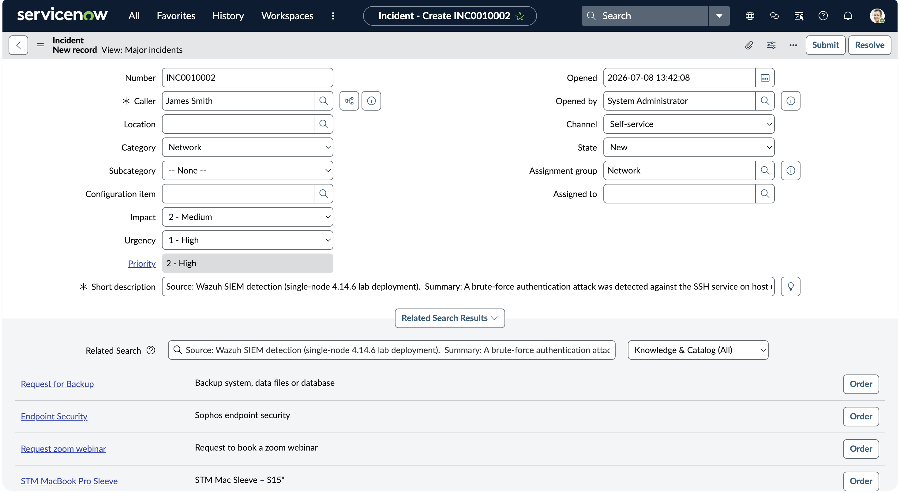
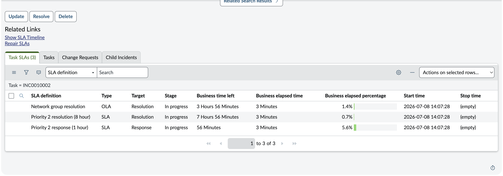
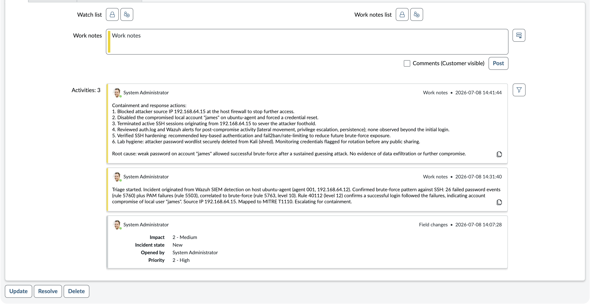
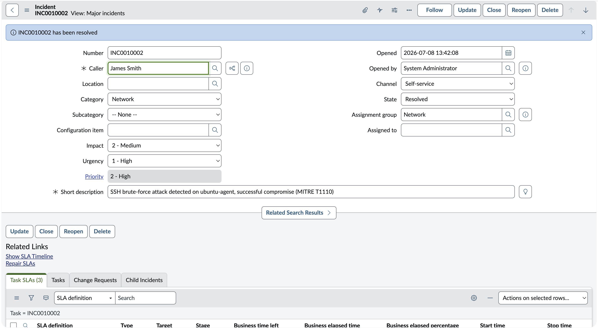
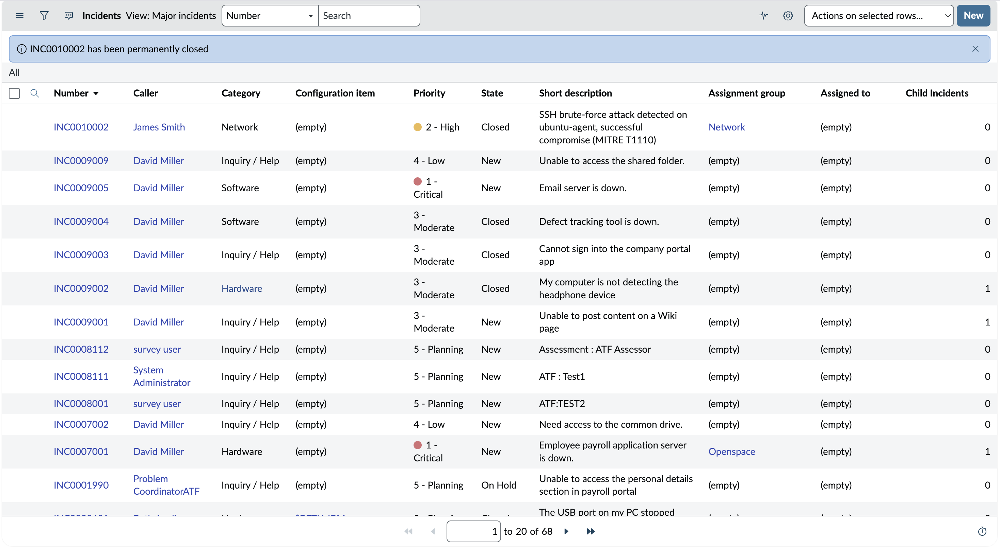

# SOC Incident Lifecycle in ServiceNow ITSM (SSH Brute Force, MITRE T1110)

One confirmed compromise, worked New to Closed, with a real SLA breach at 108% documented instead of hidden. This is the half of SOC work that starts after the alert fires: triage, priority, response, closure, and the unforgiving clocks running the whole time.

## At a Glance

| Field | Detail |
| --- | --- |
| Work Type | Incident response, ITSM operations |
| Incident | INC0010002, SSH brute force compromise |
| Platform | ServiceNow Personal Developer Instance (dev207002) |
| Priority | 2 High, Impact Medium by Urgency High |
| Source Detection | Wazuh SIEM, host ubuntu-agent, T1110 |
| SLA Outcome | Response SLA breached at 108.36%, documented |
| Lifecycle | New to In Progress to Resolved to Closed |
| Date | 08 July 2026 |

## What This Is

The operational counterpart to the Wazuh detection lab. A confirmed SSH brute-force compromise, originally detected in the Wazuh SIEM lab, is logged and worked through a complete ITSM incident lifecycle in a live ServiceNow instance.

The incident is created, triaged, prioritized, assigned, worked with documented response actions, resolved, and permanently closed, with automatic SLA tracking throughout. The point is what happens to a detection after it fires, which is where a Tier 1 analyst actually spends the shift.

## Incident Summary

On 08 July 2026, the SSH brute-force compromise of host ubuntu-agent (detected by Wazuh, rules 5760, 5503, 5763, 40112, mapped to MITRE T1110) was logged as incident INC0010002 in ServiceNow. It was rated Priority 2 High from Impact Medium and Urgency High, routed to the Network assignment group, and driven through the New, In Progress, Resolved, and Closed states. Each stage was documented with analyst work notes forming an auditable response timeline.

ServiceNow automatically attached three SLA timers on submission. The one-hour response SLA breached during the exercise, and that breach is documented honestly below rather than tidied away, because a record that admits the miss is the one an auditor and a shift lead both trust.

## Affected System

| Attribute | Value |
| --- | --- |
| ITSM platform | ServiceNow Personal Developer Instance (dev207002) |
| Incident number | INC0010002 |
| Caller | James Smith |
| Opened by | System Administrator (SOC analyst) |
| Category | Network |
| Priority | 2 - High (Impact 2 Medium, Urgency 1 High) |
| Assignment group | Network |
| Source detection | Wazuh SIEM, host ubuntu-agent, MITRE T1110 |
| Attacker source IP | 192.168.64.15 |
| Compromised account | james |
| Date | 08 July 2026 |

## Investigation Methodology

### 1. Baseline

Before creating any records, the instance's out-of-box state was captured. The Incident table shipped with 67 demo incidents, all generic IT issues (email outages, file share access, SAP availability). None were security incidents, giving a clean reference point against which the SOC ticket would stand out.


**SOC Observations**

The default data set contains only routine IT service disruptions. Establishing this baseline confirms the security incident created next is the analyst's own work and is clearly distinguishable from platform demo data.

### 2. Incident creation and prioritization

A new incident was created from the real Wazuh detection. The short description named the host, the outcome, and the ATT&CK technique. Severity was set through the Impact and Urgency inputs, and ServiceNow auto-calculated Priority.



**SOC Observations**

Impact was set to Medium (single host affected) and Urgency to High (a confirmed compromise means an attacker is already inside, so response is time-critical). The Impact-by-Urgency matrix resolved this to Priority 2 High.

Setting Urgency to High rather than Medium is the key judgment in the whole incident. It is the same distinction the Wazuh lab drew between a failed brute force and a real breach, carried forward into the ticket: a compromise is not urgent because it is loud, it is urgent because the attacker is already inside.

### 3. Automatic SLA tracking

On submission, ServiceNow attached three SLA and OLA timers to the incident based on its priority, and started the clocks immediately.



**SOC Observations**

The priority selection drove three commitments without any manual configuration: a Priority 2 response SLA (1 hour), a Priority 2 resolution SLA (8 hours), and a Network group resolution OLA. This is where a severity judgment stops being an opinion and becomes a deadline, the priority set in the previous step is what put these clocks on the board.

### 4. Response documentation

The incident was moved to In Progress and worked with two analyst work notes: a triage note establishing the facts, and a containment note recording the response actions. These stacked chronologically in the Activity log.



**SOC Observations**

The triage note recorded the detection source, the specific Wazuh rules that fired, the compromised account, the attacker IP, and the ATT&CK mapping. The containment note documented the response: blocking the source IP, disabling and resetting the compromised account, terminating attacker sessions, hunting for post-compromise activity (none found beyond the initial login), and recommending preventive hardening.

The Activity log now reads as a complete, timestamped response timeline. That timeline is the deliverable, not the ticket. It is what lets any analyst pick the incident up cold and know exactly what was done and when.

### 5. Resolution and SLA outcome

The incident was resolved with a resolution code and resolution notes, then permanently closed. Resolving the incident paused the resolution clocks, but the one-hour response SLA had already breached.



**SOC Observations**

At resolution the resolution SLAs were paused (13.53% and 27.06% elapsed), but the Priority 2 response SLA shows 108.36% elapsed, marked breached in red. This breach occurred because of the time taken between steps during this training exercise, not a genuine operational delay.

In a live SOC this would trigger an SLA breach notification and an escalation review. It is documented here rather than hidden, because recognizing and explaining a breach is itself part of the analyst skill set, and a portfolio that only ever shows the clean path is showing the one thing production never does.

### 6. Closure

The incident was moved to Closed, completing the lifecycle. The system confirmed the record as permanently closed.



**SOC Observations**

The incident traveled the full path New to In Progress to Resolved to Closed, with documentation at each transition. The closed record is the permanent artifact of the response, the thing that outlives the shift.

## Indicators of Compromise

| Type | Indicator |
| --- | --- |
| Source IP | 192.168.64.15 |
| Compromised account | james |
| Service | SSH, TCP 22 |
| Source detection | Wazuh rules 5760, 5503, 5763, 40112 |
| ITSM record | INC0010002 |

## MITRE ATT&CK

| Tactic | Technique | ID |
| --- | --- | --- |
| Credential Access | Brute Force | T1110 |
| Credential Access | Password Guessing | T1110.001 |
| Defense Evasion, Persistence, Privilege Escalation, Initial Access | Valid Accounts | T1078 |

## Findings

The detection from the Wazuh lab was successfully operationalized as a managed incident. The severity was set with defensible reasoning, the ticket was routed to an appropriate group, and the response was documented so any analyst could pick up the incident and understand its full history.

The lifecycle completed cleanly, and the one SLA breach was identified and explained rather than obscured. A clean lifecycle with an honest breach is a more credible record than a flawless one, because the flawless one usually means the clock was never really running.

## Response

The incident record captures the response taken against the compromise: source IP blocked, compromised credential disabled and reset, attacker sessions terminated, post-incident hunt completed with no further compromise found, and preventive hardening (key-based authentication, rate-limiting) recommended. The resolution and close notes formally documented the outcome and root cause, a weak password on the james account.

## The SOC Angle

Detection is only half of security operations, and this lab is the other half.

A fired alert has no value until it is triaged, prioritized, worked, and closed with a clear record of what was done and why. Working this incident in ServiceNow made three operational realities concrete. Severity is a deliberate judgment with downstream consequences, it drove the SLA commitments automatically. Documentation is the medium through which a response is coordinated and audited, not paperwork after the fact. And SLAs are unforgiving clocks that start whether or not anyone is watching them.

Seeing the response SLA breach in real time was the sharpest lesson. It showed exactly how time pressure is built into the tooling a SOC runs on, and why the analyst who notices the clock is the one who does not breach it.

## What This Demonstrates

Provisioning and operating a live ServiceNow ITSM instance from scratch.

Translating a real SIEM detection into a properly categorized, prioritized incident.

Applying the Impact-by-Urgency matrix to set a defensible priority for a confirmed compromise.

Documenting a full response timeline using analyst work notes.

Observing automatic SLA and OLA tracking and interpreting a real SLA breach.

Driving an incident through the complete New to Closed lifecycle.

Documenting a breach honestly rather than hiding it, and explaining why it happened.

## Repository Structure

```
02-servicenow-itsm/
├── README.md
└── screenshots/
    ├── 01_baseline_incident_list.png
    ├── 02_incident_created_in_queue.png
    ├── 03_sla_timers_inprogress.png
    ├── 04_activity_worknotes_timeline.png
    ├── 05_sla_breach_resolved.png
    └── 06_incident_closed_final.png
```

## Conclusion

This project completed the operational counterpart to the Wazuh detection lab: a real security detection was managed end to end as a ServiceNow incident, from creation through prioritization, response documentation, resolution, and permanent closure, with automatic SLA tracking and an honestly documented breach. Together with the detection project, it shows both halves of SOC work, seeing the attack and running the response.

---

[](https://linkedin.com/in/WilliamInCyber)
[](https://x.com/WilliamInCyber)
