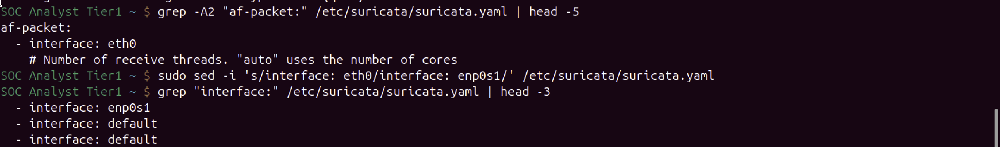
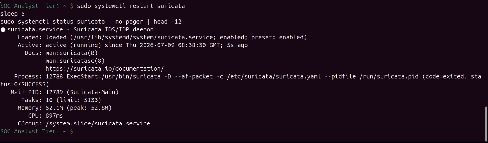
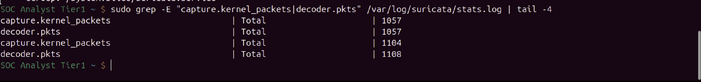
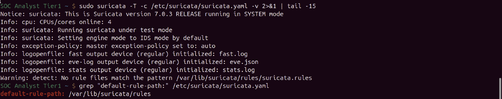
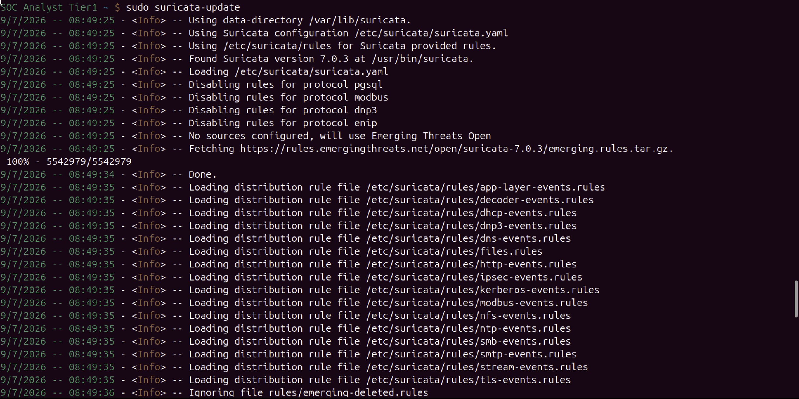
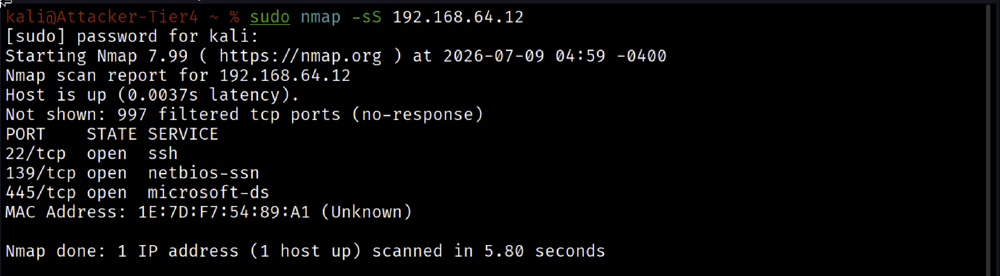
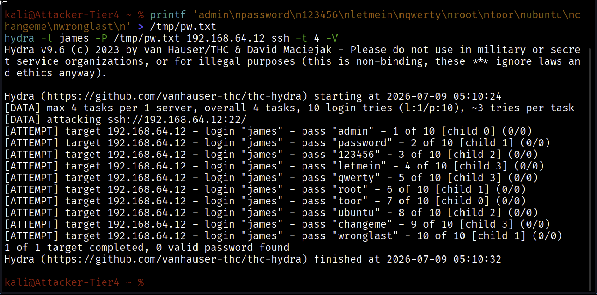
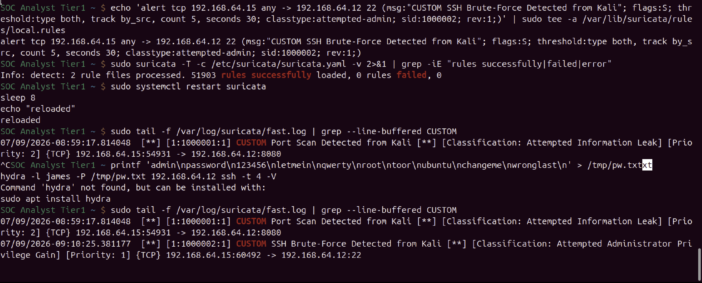

# Network Intrusion Detection with Suricata (Custom Rules, MITRE T1046 and T1110)

## Incident Summary

Suricata was deployed as a network IDS on the Ubuntu victim host, and two custom detection rules were written from scratch to catch attacks from the Kali attacker at the network layer: a port scan and an SSH brute-force. Both rules fired on live traffic. The SSH brute-force rule detects the same attack that was caught host-side by Wazuh in an earlier lab, demonstrating layered detection across two independent sensors.

## Executive Summary

On 09 July 2026, Suricata 7.0.3 was installed on host ubuntu-agent (192.168.64.12) and configured to inspect its live network interface. After loading the Emerging Threats Open ruleset, two custom rules were authored and validated: sid 1000001 detects a port scan by thresholding SYN packet rate, and sid 1000002 detects an SSH brute-force by thresholding connection attempts to port 22. An Nmap scan and a Hydra brute-force from Kali (192.168.64.15) each triggered their respective custom rule, confirmed in Suricata's alert log. The SSH brute-force detection provides a network-layer view of the same attack previously detected at the host layer by Wazuh, showing defense in depth.

## Affected System

| Attribute | Value |
| --- | --- |
| IDS platform | Suricata 7.0.3, IDS mode |
| Sensor host | ubuntu-agent (192.168.64.12) |
| Monitored interface | enp0s1 |
| Attacker host | Kali Linux, hostname Attacker-Tier4 |
| Attacker source IP | 192.168.64.15 |
| Custom rules | sid 1000001 (port scan), sid 1000002 (SSH brute-force) |
| Date | 09 July 2026 |

## Investigation Methodology

### 1. Baseline and sensor placement

Suricata can only alert on traffic it can see, so the sensor was placed on the victim host where it would observe all attack traffic directed at it. The victim's active interface was identified as enp0s1 (holding 192.168.64.12); the loopback and the down Docker bridge were excluded.

**SOC Observations**

Correct interface selection is the foundation of network IDS. Pointing Suricata at the wrong interface would result in zero visibility and silent detection failure, so the monitored interface was confirmed before any rule work.

### 2. Installation and interface correction

Suricata was installed from the Ubuntu package system. Its default configuration monitored eth0, an interface that does not exist on this host. The af-packet interface was corrected to enp0s1.



**SOC Observations**

The default eth0 configuration is a common Suricata pitfall. This host uses predictable interface naming (enp0s1), so the config was edited to match. Without this correction the engine would have captured nothing.

### 3. Verifying packet capture

The service was started and confirmed running, then its capture counters were checked while generating test traffic to prove it was reading the wire.





**SOC Observations**

A running service is not the same as a capturing one. The capture.kernel_packets and decoder.pkts counters climbed during test traffic, confirming Suricata was actively decoding packets on enp0s1 before any detection rules were trusted.

### 4. Loading the ruleset and resolving the rule path

A config test surfaced two issues: the default ruleset file was absent, and Suricata's default rule path (/var/lib/suricata/rules) differed from where the custom rule was first written. The Emerging Threats Open ruleset was downloaded, and the custom rule file was placed in the correct path.





**SOC Observations**

suricata-update fetched and loaded the Emerging Threats Open ruleset (over 51,000 enabled rules). Aligning the custom rule file to Suricata's default-rule-path ensured the hand-written rules were actually loaded alongside the defaults, verified by the rule count increasing by one per custom rule with zero failures.

### 5. Custom detection rules and live attacks

Two custom rules were written and validated, then triggered by live attacks from Kali.

Rule sid 1000001 (port scan): alert on 20 or more SYN packets from the attacker within 10 seconds, classified as attempted reconnaissance. An Nmap SYN scan triggered it.

Rule sid 1000002 (SSH brute-force): alert on 5 or more connection attempts to port 22 within 30 seconds, classified as attempted administrator privilege gain. A Hydra brute-force triggered it.

The attacker-side view of each attack is shown below, followed by the defender-side detection.







**SOC Observations**

Both hand-written rules fired on real attack traffic. The port scan alert (sid 1000001) shows the attacker source, and the SSH brute-force alert (sid 1000002) is classified Priority 1 (Attempted Administrator Privilege Gain), reflecting the seriousness of a credential attack on SSH. Both alerts trace cleanly to 192.168.64.15 targeting 192.168.64.12. During testing, some benign background alerts from the host's Splunk forwarder traffic (port 9997) also appeared; these were identified as unrelated lab noise and excluded from the incident scope.

## Indicators of Compromise

| Type | Indicator |
| --- | --- |
| Source IP | 192.168.64.15 |
| Port scan target | 192.168.64.12, multiple ports |
| Brute-force target | 192.168.64.12, TCP 22 |
| Custom rule (scan) | sid 1000001 |
| Custom rule (brute-force) | sid 1000002 |

## MITRE ATT&CK

| Tactic | Technique | ID | Detection |
| --- | --- | --- | --- |
| Reconnaissance | Active Scanning | T1595 | Custom rule sid 1000001 |
| Discovery | Network Service Discovery | T1046 | Custom rule sid 1000001 |
| Credential Access | Brute Force | T1110 | Custom rule sid 1000002 |

## SOC Analyst Findings

Suricata was successfully deployed as a network sensor and extended with two custom detection rules that fired on live attacks. The SSH brute-force detection is significant because it observes the same attack that was previously detected host-side by Wazuh. One attack, seen by two independent sensors at two different layers, is the practical meaning of defense in depth.

## SOC Analyst Response

In a production environment these alerts would feed a SIEM for correlation and would drive containment: blocking the scanning and brute-forcing source IP, and hardening SSH exposure. The port-scan rule provides early warning of reconnaissance, and the brute-force rule provides a network-layer tripwire that does not depend on host logging being intact, valuable if an attacker later tampers with host logs.

## Analyst Insight

Writing detection rules is different from running someone else's. Getting these two rules to fire required understanding rule anatomy (action, protocol, direction, options), threshold logic (rate over time, tracked by source), and the operational plumbing (the right interface, the right rule path, config validation before reload). The most useful realization was that network detection and host detection are complementary, not redundant. Wazuh sees what the host logs; Suricata sees what crosses the wire. An attacker who evades one may still be caught by the other. Building both for the same attack made the value of layered detection concrete.

## Learning Outcome

- Deployed Suricata as a network IDS on the correct monitoring interface
- Diagnosed and fixed the default interface and rule-path mismatches
- Loaded the Emerging Threats Open ruleset and validated configuration before reload
- Wrote two custom detection rules from scratch with threshold-based logic
- Triggered both rules with live Nmap and Hydra attacks and confirmed them in the alert log
- Distinguished real attack alerts from benign background noise
- Demonstrated defense in depth by detecting the same SSH brute-force at both host and network layers

## Repository Structure

```
03-suricata-ids/
├── README.md
└── secreenshots/
    ├── 01_suricata_service_running.png
    ├── 02_suricata_packet_capture.png
    ├── 03_interface_fix_enp0s1.png
    ├── 04_config_test_rulepath.png
    ├── 05_suricata_update_ruleset.png
    ├── 06_custom_rules_both_alerts.png
    ├── 07_kali_nmap_portscan.png
    └── 08_kali_hydra_bruteforce.png
```

## Conclusion

This project added a network detection layer to the lab. Suricata was deployed, configured, and extended with custom rules that detected both reconnaissance and credential attacks from a real attacker. Paired with the earlier Wazuh host-based detection of the same SSH brute-force, it demonstrates the core principle of layered defense: independent sensors at different layers give an attacker fewer places to hide.
